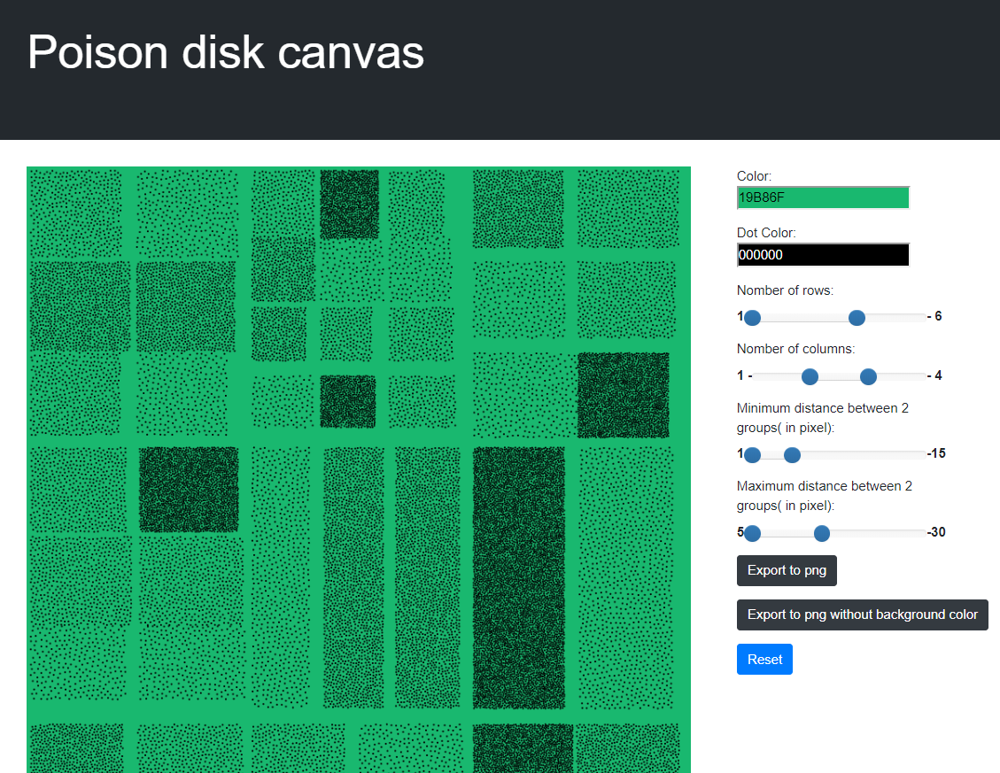
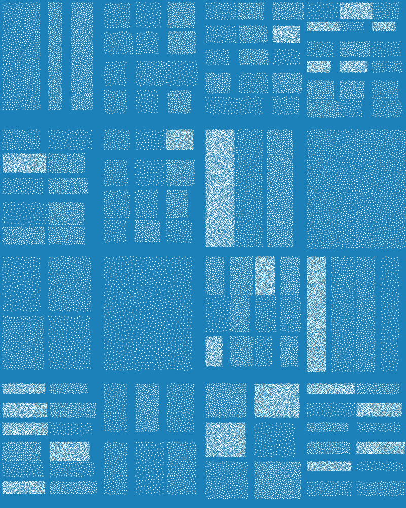
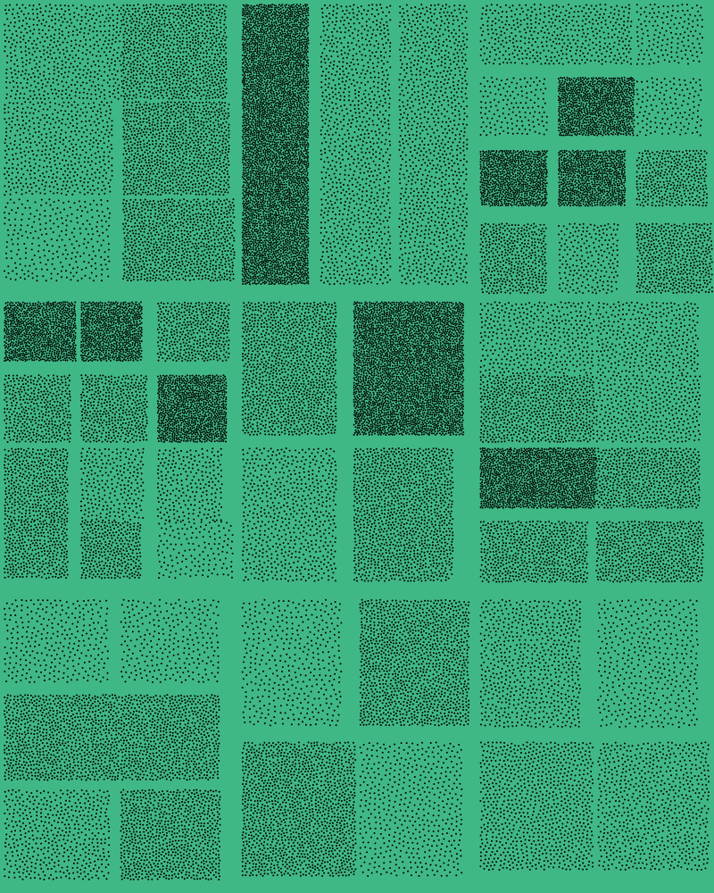
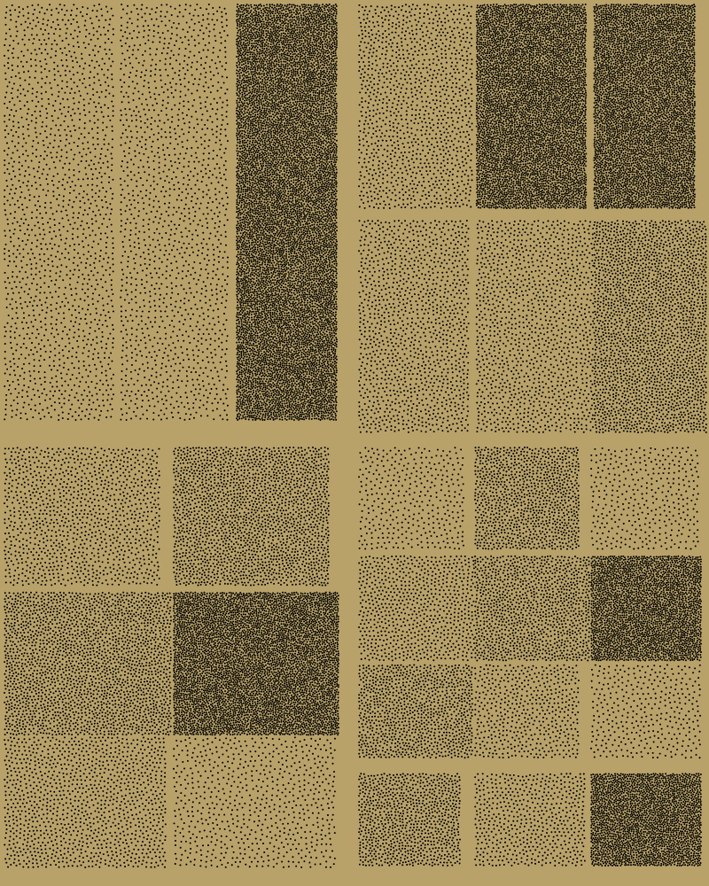

## Try online 
[website](https://guillaume-gomez.github.io/poisson-disk/)

## samples




## Run locally 
```
yarn
yarn dev

```
Open the file index.html by clicking on it or on command line. (ie on brave `brave-browser index.html`)
